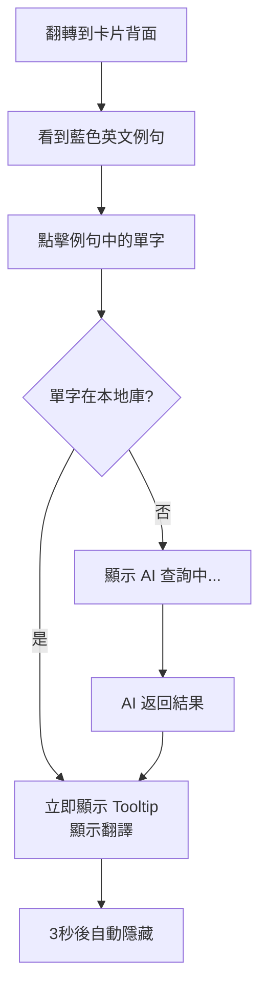
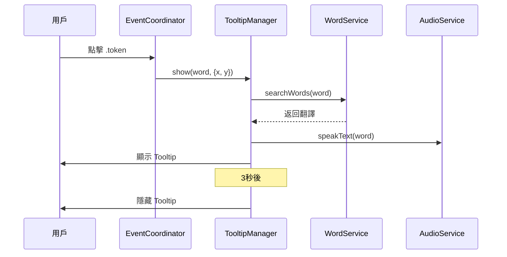
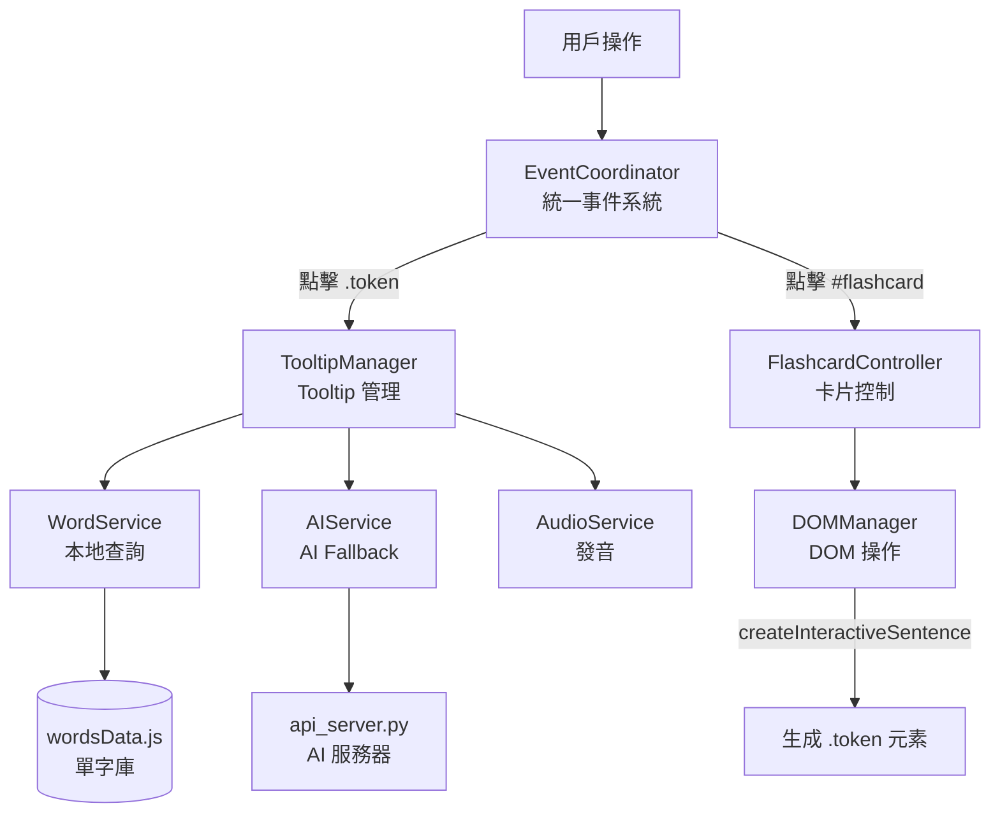

# 📖 英文練習 App - 使用流程文檔（重構版）

## 🎯 系統概述

本應用採用**重構後的模組化架構**，提供流暢的互動式英文學習體驗。

### 核心功能
- 📚 **單字練習**：翻轉卡片學習單字
- 🎧 **聽力測驗**：聽音辨字
- 📝 **動詞三態**：填空練習
- ✨ **互動例句**：點擊單字即時查看翻譯（新功能）
- 🤖 **AI 輔助**：智能生成未收錄單字

---

## 🚀 啟動流程

### 1. 啟動本地服務器

```powershell
# 進入專案目錄
cd d:\English_app

# 啟動 HTTP 服務器
python -m http.server 8085
```

### 2. 訪問應用

在瀏覽器打開：
```
http://localhost:8085/new_index.html
```

### 3. 驗證初始化

按 **F12** 打開 Console，應該看到：

```
🚀 App Initializing (Refactored Architecture)...
[TooltipManager] ✓ Initialized
[App] ✓ Events registered
[EventCoordinator] Registered: click:.token
[EventCoordinator] Registered: click:#flashcard
[EventCoordinator] ✓ Initialized with 2 handlers
✅ App Initialized Successfully
```

✅ **出現以上日誌表示初始化成功！**

---

## 📱 主要使用流程

### 流程 A：單字練習（基礎）

```mermaid
graph LR
    A[首頁] --> B[點擊"單字練習"]
    B --> C[選擇學制<br/>國中/高中/進階]
    C --> D[選擇等級<br/>國一/國二/...]
    D --> E[點擊"開始"]
    E --> F[卡片顯示]
    F --> G[點擊卡片翻轉]
    G --> H[查看例句與翻譯]
```

#### 詳細步驟

1. **進入練習**
   - 首頁點擊 **"單字練習"**
   - 或底部導航點擊 **"單字"**

2. **選擇範圍**
   - **Step 1**: 點選學制（國中/高中/進階）
   - **Step 2**: 點選等級（如：國二）
   - 點擊 **"開始"** 按鈕

3. **學習單字**
   - **正面**：顯示中文翻譯
   - **點擊卡片中心**：翻轉到背面
   - **背面**：顯示英文單字、音標、例句

4. **操作按鈕**
   - 🔊 **喇叭圖示**：播放單字發音
   - ⬅️ **上一個**：前一張卡片
   - ➡️ **下一個**：下一張卡片
   - ▶️ **自動播放**：開始自動播放模式

---

### 流程 B：互動例句（核心新功能）



#### 詳細步驟

1. **進入練習模式**（如流程 A）

2. **翻轉卡片**
   - 點擊卡片中心
   - 看到背面的例句區域

3. **點擊例句單字**
   - 例句中的單字是**藍色可點擊**的
   - 點擊任意單字（如 "need", "open", "account"）

4. **查看 Tooltip**
   - **立即顯示**：黑色半透明視窗
   - **位置**：浮在點擊位置上方
   - **內容**：`單字: 中文翻譯`
   - **音效**：自動播放該單字發音

5. **Tooltip 自動隱藏**
   - 3 秒後自動消失
   - 或點擊其他位置手動關閉

#### Console 日誌（驗證）

```
[App] Token clicked: need
[TooltipManager] Showing tooltip for "need"
```

---

### 流程 C：聽力練習

```mermaid
graph LR
    A[首頁] --> B[點擊"聽力練習"]
    B --> C[選擇等級]
    C --> D[聽音辨字]
    D --> E[輸入答案]
    E --> F[送出/跳過]
    F --> G[下一題]
```

#### 詳細步驟

1. **進入聽力模式**
   - 首頁點擊 **"聽力練習"**
   - 或底部導航點擊 **"聽力練習"**

2. **選擇範圍**（同流程 A）

3. **答題流程**
   - 🔊 點擊喇叭圖示播放單字
   - 在輸入框輸入聽到的單字
   - 點擊 **"送出"** 檢查答案
   - 或點擊 **"跳過"** 直接看答案

4. **查看結果**
   - ✅ **正確**：綠色提示
   - ❌ **錯誤**：顯示正確答案
   - 點擊 **"下一題"** 繼續

---

### 流程 D：動詞三態

```mermaid
graph LR
    A[首頁] --> B[點擊"動詞三態"]
    B --> C[選擇國中/高中]
    C --> D[查看原型動詞]
    D --> E[填寫過去式<br/>過去分詞]
    E --> F[檢查答案]
    F --> G[上/下一個]
```

#### 詳細步驟

1. **進入三態練習**
   - 首頁點擊 **"動詞三態"**
   - 或底部導航點擊 **"三態"**

2. **選擇難度**
   - 點擊 **"國中 (JH)"** 或 **"高中 (SH)"**

3. **填寫答案**
   - 看到 **Base Form（原型）** 和中文
   - 填寫 **Past Tense（過去式）**
   - 填寫 **Past Participle（過去分詞）**

4. **驗證與導航**
   - 點擊 **"檢查答案"** 驗證
   - 使用 **"上一個"** / **"下一個"** 導航

---

## 🔧 功能詳解

### 1. 事件系統（EventCoordinator）

**原理**：統一的事件委託系統

```javascript
// 註冊流程（開發者視角）
eventCoordinator.register('.token', 'click', handler, { stopPropagation: true });
eventCoordinator.register('#flashcard', 'click', handler);
eventCoordinator.init(); // 啟動監聽
```

**用戶視角**：
- 點擊任何 `.token` 元素 → 自動觸發 Tooltip
- 點擊 `#flashcard` → 自動翻轉
- **不會**干擾按鈕或輸入框的點擊

---

### 2. Tooltip 管理（TooltipManager）

**工作流程**：



**特性**：
- ✅ **自動定位**：使用 CSS 變量定位在游標附近
- ✅ **本地優先**：優先查詢本地單字庫
- ✅ **AI Fallback**：本地無資料時調用 AI
- ✅ **自動隱藏**：3 秒後自動消失
- ✅ **發音整合**：自動播放單字發音

---

### 3. 單字查詢（WordService）

**查詢邏輯**：

```javascript
// 本地查詢
const result = WordService.searchWords(['need']);
// 返回：{ validWords: [...], invalidWords: [] }
```

**數據來源**：
- `data/wordsData.js`：主要單字庫（8000+ 單字）
- LocalStorage：用戶自訂單字

---

### 4. AI 輔助（AIService）

**觸發條件**：
- 點擊的單字**不在本地庫**（8656 個單字）
- 本地 AI 服務器必須運行

**完整啟動流程**：

```bash
# Terminal 1: 前端服務器
cd d:\English_app
python -m http.server 8085

# Terminal 2: AI API 服務器（需要 Python 3.11+）
cd d:\English_app
pip install -r requirements.txt  # 首次執行
python api_server.py
```

**AI 服務器輸出**：
```
==================================================
🚀 AI Translation API Server
==================================================
📍 Running on: http://127.0.0.1:5000
🔑 API Key: ✓ Configured
🤖 Model: gemini-pro
==================================================
```

**前端行為**：
1. 顯示 "🤖 [word]: AI 查詢中..."
2. 呼叫本地 API (port 5000)
3. API 使用 Google Gemini 翻譯
4. 更新 Tooltip 顯示翻譯
5. 提供 "➕ 加入單字庫" 按鈕（未來功能）

**技術架構**：
```
前端 (localhost:8085)
  ↓ POST /api/generate-card
本地 API (localhost:5000)
  ↓ Gemini API
Google Cloud AI
```

---

## 🐛 常見問題排查

### Q1: 頁面無法載入

**症狀**：瀏覽器顯示 404 Not Found

**解決方案**：
```bash
# 1. 確認當前目錄
pwd  # 應該在 d:\English_app

# 2. 確認文件存在
ls new_index.html

# 3. 重啟服務器
python -m http.server 8085
```

---

### Q2: Console 沒有初始化日誌

**症狀**：Console 空白或有錯誤

**檢查步驟**：
1. **硬刷新**：Ctrl+Shift+F5
2. **檢查版本**：確認 `main.js?v=20251215_REFACTORED`
3. **查看錯誤**：Console 有紅色錯誤訊息嗎？

**常見錯誤**：
```
Failed to load module script: Expected a JavaScript module script
```
→ 確保所有 import/export 使用正確

---

### Q3: 卡片無法翻轉

**診斷**：
```javascript
// Console 執行
const card = document.getElementById('flashcard');
console.log('Card exists:', !!card);
console.log('Has class:', card.className);

// 手動測試
card.classList.toggle('flipped');
```

**可能原因**：
- EventCoordinator 未初始化
- 點擊位置在按鈕上（被忽略）
- CSS 動畫衝突

---

### Q4: Tooltip 不顯示

**診斷清單**：
```javascript
// 1. 檢查元素
const tooltip = document.getElementById('translation-tooltip');
console.log('Tooltip exists:', !!tooltip);
console.log('Display:', window.getComputedStyle(tooltip).display);
console.log('Opacity:', window.getComputedStyle(tooltip).opacity);

// 2. 檢查 Token
const tokens = document.querySelectorAll('.token');
console.log('Token count:', tokens.length);

// 3. 手動顯示
tooltip.textContent = 'TEST';
tooltip.classList.add('visible');
```

**常見原因**：
- ❌ Tooltip CSS 未載入 → 檢查 `<link>` 標籤
- ❌ TooltipManager 未初始化 → 檢查 Console 日誌
- ❌ Token 元素未生成 → 檢查例句 HTML

---

### Q5: Tooltip 位置錯誤

**預期行為**：浮在點擊位置上方 50px

**檢查**：
```javascript
// Console
const tooltip = document.getElementById('translation-tooltip');
console.log('Left:', tooltip.style.getPropertyValue('--tooltip-x'));
console.log('Top:', tooltip.style.getPropertyValue('--tooltip-y'));
```

**修復**：確保 `tooltip_dark.css` 正確載入且包含 CSS 變量

---

## 📊 系統架構圖



---

## ✅ 檢查清單

### 開發環境
- [ ] Python 3.11+ 已安裝
- [ ] HTTP 服務器運行在 `d:\English_app`
- [ ] 瀏覽器支持 ES6 模組

### 功能驗證
- [ ] 初始化日誌完整顯示
- [ ] 卡片翻轉正常
- [ ] Token 元素存在（藍色可點擊）
- [ ] 點擊 Token 顯示 Tooltip
- [ ] Tooltip 位置正確（游標附近）
- [ ] Tooltip 自動隱藏（3秒）
- [ ] 發音功能正常

### 進階功能
- [ ] AI 服務器運行（可選）
- [ ] AI Fallback 正常運作
- [ ] "加入單字庫" 按鈕顯示（未來）

---

## 🚀 下一步開發

### 短期優化
1. **Tooltip 樣式增強**
   - 添加箭頭指向點擊位置
   - 支持深色/淺色主題切換

2. **性能優化**
   - Token 元素懶加載
   - Debounce 快速點擊

### 中期功能
3. **"加入單字庫"** 
   - AI 查詢結果保存到用戶詞彙表
   - 支持自訂分類

4. **統計與進度**
   - 記錄點擊過的單字
   - 生成學習報告

### 長期規劃
5. **離線模式**
   - Service Worker 緩存
   - PWA 支持

6. **多語言支持**
   - 介面國際化
   - 支持日文、韓文等

---

## 📚 相關文檔

- [架構分析](file:///C:/Users/Owner/.gemini/antigravity/brain/636d0bbc-d667-4cd7-af6d-8b79d08adc88/architecture_analysis.md) - 重構決策
- [實施計劃](file:///C:/Users/Owner/.gemini/antigravity/brain/636d0bbc-d667-4cd7-af6d-8b79d08adc88/implementation_plan.md) - 重構步驟
- [任務追蹤](file:///C:/Users/Owner/.gemini/antigravity/brain/636d0bbc-d667-4cd7-af6d-8b79d08adc88/task.md) - 進度檢查

---

**版本**：v2.1 (Tooltip + AI Integration)  
**最後更新**：2025-12-16  
**維護者**：AI Coding Assistant
